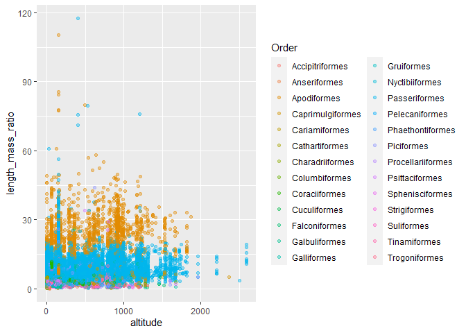

**Notes for code:**

-   **show tidied code, spaces, comments, make it readable, be
    CONSISTANT**

-   **filter, mutate, summarize, join (combine data), variables in code
    and show created variables**

-   **use: bar chart, histogram, multiple variables (scatter plot).
    Label well.**

-   **Do a mean and a confidence interval**

-   **Include a readme with abstract, author name, and table of
    content**

# **Morphological Analysis of Birds in the Atlantic Forest of South America**

Casey Perkins, Bryn Rivenes

## Introduction

-   **Allen’s Rule**: body surface area to volume ratio for animals
    varies with the average temperature of a creature’s habitat  (Allen
    A, 1877)​

-   The lower the surface area, the less heat can escape, so animals at
    higher altitudes should have less surface area and a higher body
    mass​

-   There have been many studies that support Allen’s Rule (LIST
    SOURCES)

-   However, some studies have shown this rule to be inaccurate (Alho
    J, et al. 2010)​

-   We set out to test **Allen’s Rule** using an existing data set of
    bird morphological traits

    

## Methods

-   Our data came from **The Atlantic Bird’s Data Set**; a data set of
    bird morphological traits and locations complied over decades by
    many scientists through museum collections, online data bases,
    published sources, and unpublished reports for data
    analysis (Hasui E, et al. 2017)​

-   It includes data from **72,483 individual birds** and **780
    species**​

-   The Atlantic Forest is located mostly on the East coast
    of Brazil, with some of it stretching into Argentina and Paraguay​

-   We use the length to mass ratio as a proxy for body
    surface-area-to-volume ratio

    

-   **discuss getting data/how it was collected and analyzing data**

-   **discuss/cite R and pkgs**

## Results

<!-- -->

Figure 1. We ran our mass to length ratio with altitude and found we had
very messy data

<!-- -->

<!-- -->

-   Here we noticed that our data were severely right skewed

<!-- -->

-   We corrected the skew in our data by transforming it by taking the
    natural log of our data points

<!-- --><!-- -->

-   We plotted the mean lmr for each genus/species and saw a slight
    upward trend which intensified when we looked exclusivly at
    altitudes higher than 1000

    <!-- -->

-   We took the mean lmr of birds found over 1000 m and birds found
    under 1000 and found the means were different

-   The mean lmr of birds found above 1000 m = 7.9 while the mean lmr of
    birds found below 1000 m = 5.2. A Welch’s Two Sample t-test found
    t(76) = 3.6, p =0.0005.

-   **Text describing what we did and what it means then back up with
    figure/graph**

-   **add figure legends to each graph (Fig. 1)**

## Discussion

-   We predicted length mass ratio would decrease with elevation
    however, our analysis and t-test show an increase in length mass
    ratio with increased elevation​

-   This is the exact **opposite** of what we would expect to see
    according to **Allen’s Rule** ​

-   Other studies have found similar results that contradict **Allen’s
    Rule** and suggest that the body surface area to volume ratio has a
    genetic basis rather than an environmental one (Alho J, et al. 2010)

-   **Restate findings briefly**

-   **talk about what is MEANS**

-   **talk about what we could do with these findings in the
    future/future experiments**

## References

-   ALHO, J.S., HERCZEG, G., LAUGEN, A.T., RÄSÄNEN, K., LAURILA, A. and
    MERILÄ, J. (2011), Allen’s rule revisited: quantitative genetics of
    extremity length in the common frog along a latitudinal gradient.
    Journal of Evolutionary Biology, 24: 59-70.
    <https://doi.org/10.1111/j.1420-9101.2010.02141.x>

-   Allen, Joel Asaph (1877). “The influence of Physical conditions in
    the genesis of species”. Radical Review. 1: 108–140.

-   Blackburn T, Ruggiero A. Latitude, elevation and body mass variation
    in Andean passerine birds. Global Ecology and Biography 2001 (cited
    2022 Feb 18); 10: 245-259.

-   Hasui, É., Metzger, J.P., Pimentel, R.G., Silveira, L.F., Bovo,
    A.A.d.A., Martensen, A.C., Uezu, A., Regolin, A.L., Bispo de
    Oliveira, A.Â., Gatto, C.A.F.R., Duca, C., Andretti, C.B.,
    Banks-Leite, C., Luz, D., Mariz, D., Alexandrino, E.R., de Barros,
    F.M., Martello, F., Pereira, I.M.d.S., da Silva, J.N., Ferraz,
    K.M.P.M.d.B., Naka, L.N., dos Anjos, L., Efe, M.A., Pizo, M.A.,
    Pichorim, M., Gonçalves, M.S.S., Cordeiro, P.H.C., Dias, R.A.,
    Muylaert, R.d.L., Rodrigues, R.C., da Costa, T.V.V., Cavarzere, V.,
    Tonetti, V.R., Silva, W.R., Jenkins, C.N., Galetti, M. and Ribeiro,
    M.C. (2018), ATLANTIC BIRDS: a data set of bird species from the
    Brazilian Atlantic Forest. Ecology, 99: 497-497.
    <https://doi.org/10.1002/ecy.2119>

-   Lamichhaney S, Han F, Berglund J, Wang C, Almén MS, Webster MT,
    Grant BR, Grant PR, Andersson L. A beak size locus in Darwin’s
    finches facilitated character displacement during a drought.
    Science. 2016 (cited 2022 Feb 18);352(6284):470-4

-   Landmann A, Winding N. Guild Organization and Morphology of
    High-Altitude Granivorous and Insectivorous Birds: Convergent
    Evolution in an Extreme Environment. Oikos. 2995 (cited 2022 Feb
    18);73(2):237-250.

-   Sun Y, Li M, Song G, Lei F, Li D, Wu Y. The Role of Climate Factors
    in Geographic Variation in Body Mass and Wing Length in a Passerine
    Bird. Avian Res. 2017 (cited 2022 Feb 19); 8, 1.

-   **add citations for R, and pkgs used. (and maybe images?)**

-   **cite every source in the text**

## Acknowledgments

-   We would like to thank the original authors of the Atlantic Birds
    Data Set and all of those who helped compile it through museum
    collections, online data bases, published sources, and unpublished
    reports, as well as the people out out in the field who originally
    collected this data.

-   We also would like to thank Dr. Chris Merkord for his guidance with
    coding and data analyse.
