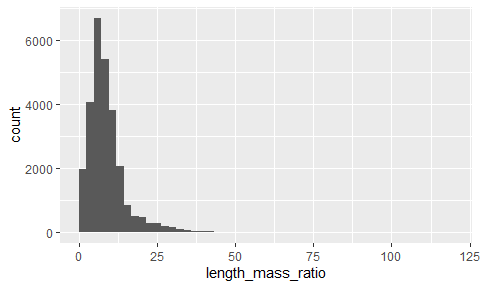
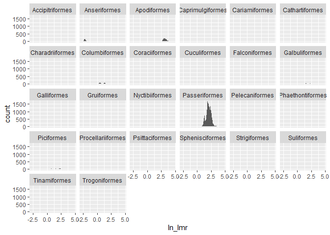
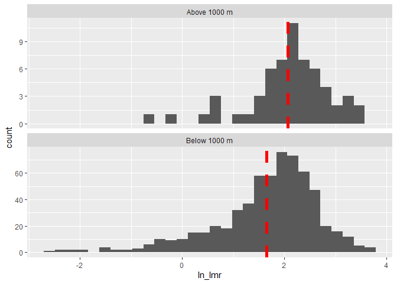

# **Morphological Analysis of Birds in the Atlantic Forest of South America**

Casey Perkins, Bryn Rivenes

## Introduction

-   **Allen’s Rule**: body surface area to volume ratio for animals
    varies with the average temperature of a creature’s habitat  (Allen
    A, 1877)​

-   The lower the surface area, the less heat can escape, so animals at
    higher altitudes should have less surface area and a higher body
    mass​

-   There have been many studies that support Allen’s Rule (LIST
    SOURCES)

-   However, some studies have shown this rule to be inaccurate (Alho
    J, et al. 2010)​

-   We set out to test **Allen’s Rule** using an existing data set of
    bird morphological traits

    

###### Image 1: Photo of a Blue Dacnis (Dacnis cayana) (Photo from Jarbas Mattos)

###### Image 2: Photo of a Masked Duck (Nomonyx dominicus) (Photo from Ron Bielefeld/Audubon Photography Awards)

## Methods

-   The Atlantic Forest is located mostly on the East coast
    of Brazil, with some of it stretching into Argentina and Paraguay.

-   ​Our data came from **The Atlantic Bird’s Data Set**; a data set of
    bird morphological traits and locations complied over decades by
    many scientists through museum collections, online data bases,
    published sources, and unpublished reports for data
    analysis (Hasui E, et al. 2017). It includes data from **72,483
    individual birds** and **780 species**​.

-   Using R and R Studio along with the packages tidyverse and ggrepel,
    we examined this data.

-   We use the length to mass ratio as a proxy for body
    surface-area-to-volume ratio

-   We used R in addition to the Tidyverse and Ggrepel packages to graph
    and analyze this data to compare the length to mass ratio of these
    birds vs altitude at which the specimen was found.

-   We later focused on just the order Passeriformes, and then narrowed
    it down even farther to just the genus Turdus to try and get a more
    accurate result.

    

###### Photo 3: A map of the Atlantic Forest (Image by Viviane G. FerroPriscila LemesAdriano S. MeloRafael Loyola)

###### Photo 4: One way to collect bird data is through catching birds in bird nets. (Photo of a MacGillivray’s Warbler in a mist net) (Photo from animalia7)

## Results

<!-- -->

###### Figure 1: We ran our mass to length ratio with altitude and found we had very messy data

<!-- -->

###### Figure 2: We then looked at the same graph but with each order represented by a color and still did not see any major correlations.

<!-- -->

###### Figure 3: Here we wanted to see if our data had a normal distribution and instead found that it was severely right skewed.

<!-- -->

###### Figure 4: We then examined this histogram for each order.

<!-- -->

###### Figure 5: We corrected the skew in our data by transforming it by taking the natural log of the length mass ratios (lmr).

As we can see from Figure 4 and 5, the majority of our data seems to
come from one order, the Passeriformes. A few other groups (such as
Anseriformes) could be skewing our data. Because of this, we decided to
focus on just this one group.

<!-- -->

###### Figure 6: Examining the log of the lmr vs altitude for each species in the genus Turdus, we were able to see a slight positive correlation.

<!-- --><!-- -->

###### Figure 6: We plotted the mean lmr for each species in the family Furnariidae and saw a slight upward trend which intensified when we looked exclusively at altitudes higher than 1000 meters.

We also looked at the ln(lmr) vs altitude for another group under
Passeriformes (the family Furnariidae), we did not see much of a
correlation. However, when we examined this family from above an
altitude of 1000 meters, we can clearly see a positive correlation
between the log of the lmr and altitude.

<!-- -->

###### Figure : two frequency charts for the ln(lmr) for all species in the order Passeriformes both above and below an altitude of 1000 meters. The red line indicates the mean of each set of data.

We examined the counts of lmr for all passeriformes species both above
and below 1000 m and we could clearly see that there was a difference in
the two means.

The mean lmr of birds found above 1000 m = 7.9 while the mean lmr of
birds found below 1000 m = 5.2. A Welch’s Two Sample t-test found t(76)
= 3.6, p =0.0005.

## Discussion

-   We predicted length mass ratio would decrease with elevation
    however, our analysis and t-test show an increase in length mass
    ratio with an increase in elevation​

-   This is the exact **opposite** of what we would expect to see
    according to **Allen’s Rule** ​

-   Other studies have found similar results that contradict **Allen’s
    Rule** and suggest that the body surface area to volume ratio has a
    genetic basis rather than an environmental one (Alho J, et
    al. 2010).

-   In future studies, we would be very interested in exploring the
    reason these birds do not seem to follow Allen’s Rule. For example,
    if we were able to find out which bird species are migratory and
    then exclude them from the data to just look at permanent species
    and see if they follow the rule.

-   It would also be interesting to explore why Allen’s Rule overall,
    seems to be applicable in some areas, but not others.

## References

-   ALHO, J.S., HERCZEG, G., LAUGEN, A.T., RÄSÄNEN, K., LAURILA, A. and
    MERILÄ, J. (2011), Allen’s rule revisited: quantitative genetics of
    extremity length in the common frog along a latitudinal gradient.
    Journal of Evolutionary Biology, 24: 59-70.
    <https://doi.org/10.1111/j.1420-9101.2010.02141.x>

-   Allen, Joel Asaph (1877). “The influence of Physical conditions in
    the genesis of species”. Radical Review. 1: 108–140.

-   Blackburn T, Ruggiero A. Latitude, elevation and body mass variation
    in Andean passerine birds. Global Ecology and Biography 2001 (cited
    2022 Feb 18); 10: 245-259.

-   Hasui, É., Metzger, J.P., Pimentel, R.G., Silveira, L.F., Bovo,
    A.A.d.A., Martensen, A.C., Uezu, A., Regolin, A.L., Bispo de
    Oliveira, A.Â., Gatto, C.A.F.R., Duca, C., Andretti, C.B.,
    Banks-Leite, C., Luz, D., Mariz, D., Alexandrino, E.R., de Barros,
    F.M., Martello, F., Pereira, I.M.d.S., da Silva, J.N., Ferraz,
    K.M.P.M.d.B., Naka, L.N., dos Anjos, L., Efe, M.A., Pizo, M.A.,
    Pichorim, M., Gonçalves, M.S.S., Cordeiro, P.H.C., Dias, R.A.,
    Muylaert, R.d.L., Rodrigues, R.C., da Costa, T.V.V., Cavarzere, V.,
    Tonetti, V.R., Silva, W.R., Jenkins, C.N., Galetti, M. and Ribeiro,
    M.C. (2018), ATLANTIC BIRDS: a data set of bird species from the
    Brazilian Atlantic Forest. Ecology, 99: 497-497.
    <https://doi.org/10.1002/ecy.2119>

-   Lamichhaney S, Han F, Berglund J, Wang C, Almén MS, Webster MT,
    Grant BR, Grant PR, Andersson L. A beak size locus in Darwin’s
    finches facilitated character displacement during a drought.
    Science. 2016 (cited 2022 Feb 18);352(6284):470-4

-   Landmann A, Winding N. Guild Organization and Morphology of
    High-Altitude Granivorous and Insectivorous Birds: Convergent
    Evolution in an Extreme Environment. Oikos. 2995 (cited 2022 Feb
    18);73(2):237-250.

-   Slowikowski *et al.*, (2021). ggrepel.
    <https://githubcom/slowkow/ggrepel>

-   Sun Y, Li M, Song G, Lei F, Li D, Wu Y. The Role of Climate Factors
    in Geographic Variation in Body Mass and Wing Length in a Passerine
    Bird. Avian Res. 2017 (cited 2022 Feb 19); 8, 1.

-   RStudio Team (2019), RStudio: Integrated Development for R. RStudio,
    Inc., Boston, MA, URL <http://www>. rstudio.com/.

-   Wickham *et al*., (2019). Welcome to the tidyverse. Jounal of Open
    Source Software, 4(43), 1686, <http://doi.org/10.21105/joss.01686>

-   Wickham H (2016). ggplot2: Elegant Graphics for Data Analysis.
    Springer-Verlag New York.

## Acknowledgments

-   We would like to thank the original authors of the Atlantic Birds
    Data Set and all of those who helped compile it through museum
    collections, online data bases, published sources, and unpublished
    reports, as well as the people out out in the field who originally
    collected this data.

-   We also would like to thank Dr. Chris Merkord for his guidance with
    coding and data analyse.
